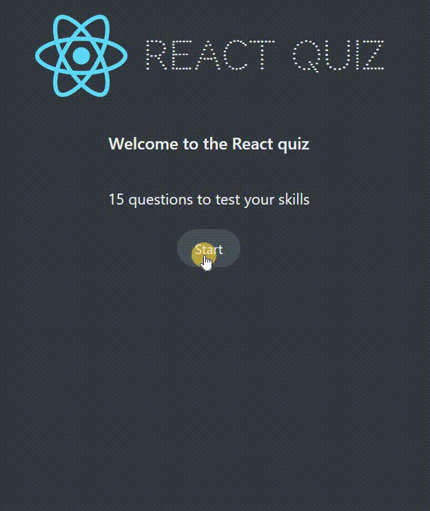

# React - Quiz App

# 🔗 [Live Preview](https://peppy-profiterole-80df83.netlify.app/)

---

## About Project 👋

This project is a Quiz App built with React, utilizing the `useReducer` hook for state management. The app allows users to take a quiz with a series of questions, providing features like a timer, scoring system, and highscore tracking. The key goal is to practice how to manage complex state transitions using `useReducer`.

---

## Features 👨‍💻

- **Start Quiz:** Users can start the quiz, initiating the timer and displaying questions one by one.

- **Answer Questions:** Users can select their answers, and the app calculates the score based on correctness.

- **Progress Tracking:** Visual feedback on progress through the quiz, showing the current question, points scored, and remaining time.

- **Timer:** A countdown timer ensures that users answer within a specific time limit.

- **Finish Quiz:** Users can finish the quiz and view their score.

- **Highscore:** The app tracks the user's highest score across sessions.

- **Restart Quiz:** Users can restart the quiz, resetting the score and timer.

---

## How it works ⚙️

#### `App` Component

- The `App` component is the main entry point, managing the quiz state with the `useReducer` hook. It controls the flow of the quiz, from start to finish, including handling user answers and updating the timer.

#### `reducer` function

- The `reducer` function handles various actions such as starting the quiz, submitting answers, moving to the next question, finishing the quiz, and updating the timer. It updates the state based on the dispatched actions and ensures the correct flow of the quiz.

**App.js and reducer function are the most important, all the logic is in there. The rest of the components are easy to understand and are conditionally rendered based on the reducer function case.**

---

## Technologies & Dependencies used 📦

- **React:** Core framework for building the user interface and managing component-based architecture.

- **useReducer:** React hook for managing complex state logic, especially useful for handling quiz progression and time tracking.

- **CSS:** Basic styling for a responsive and visually appealing layout.

dependencies:

- "@testing-library/jest-dom": "^5.17.0",
- "@testing-library/react": "^13.4.0",
- "@testing-library/user-event": "^13.5.0",
- "json-server": "^1.0.0-beta.2", 
- "react": "^18.3.1",
- "react-dom": "^18.3.1",
- "react-scripts": "5.0.1",
- "web-vitals": "^2.1.4"

***"json-server": "^1.0.0-beta.2"*** was needed for previosu version of the app where the questions were coming from fake API `localhost8000`.

Additionally **"server": "json-server --watch data/questions.json --port 8000"** was added to `scripts` inside package.json so that this fake API could be started. All the code using these things is commented out in this current version. The data is now immediately available so ignore this!

devDependencies:

- "@babel/plugin-proposal-private-property-in-object": "^7.21.11",
- "@babel/plugin-transform-private-property-in-object": "^7.24.7"

---

## Prerequisites 📚

Ensure you have the following installed on your system:

    Node.js
    npm or yarn
    Git

---

## Clone & Run locally 🏃‍♂️

1. **Clone the Repository:**

   - On the GitHub repo page, click the green "Code" button.

   - Copy the HTTPS URL.

2. **Open the Terminal:**

   - Open the terminal by typing "cmd" in your desktop's start menu, **OR**

   - Right-click on the desktop and select "Git Bash Here" (if you have Git Bash installed), **OR**

   - Open Visual Studio Code's terminal by clicking "Terminal" -> "New Terminal" inside the editor.

3. **Navigate to Your Project Location:**

   - In the terminal, navigate to your desired location (e.g., desktop) using the command: `cd desktop`. Adjust the path if your project is located elsewhere.

   - Ensure that your terminal's address is inside the project folder.

4. **Clone the Repository:**

   - Run the command: `git clone /link/`. Replace `/link/` with the HTTPS URL from step 1.

5. **Enter the Project Directory:**

   - Navigate into the cloned repository by typing: `cd /folder-name/`. Replace `/folder-name/` with the name of the cloned folder.

6. **Install Dependencies:**

   - Run the command: `npm install` to install all the necessary dependencies.

7. **Start the Project:**

   - Run the command: `npm start` or `yarn start` to start the project. It will open in your default browser at [localhost:3000/](http://localhost:3000/)

---

## Project Structure 📂

    quiz
    ├── public/ 
    ├── src/
    │  ├── components/
    │     ├── App.js
    │     ├── rest of the components...
    │  ├── index.css
    │  ├── index.js
    │  ├── questions.json
    ├── package.json 
    └── README.md 

---

